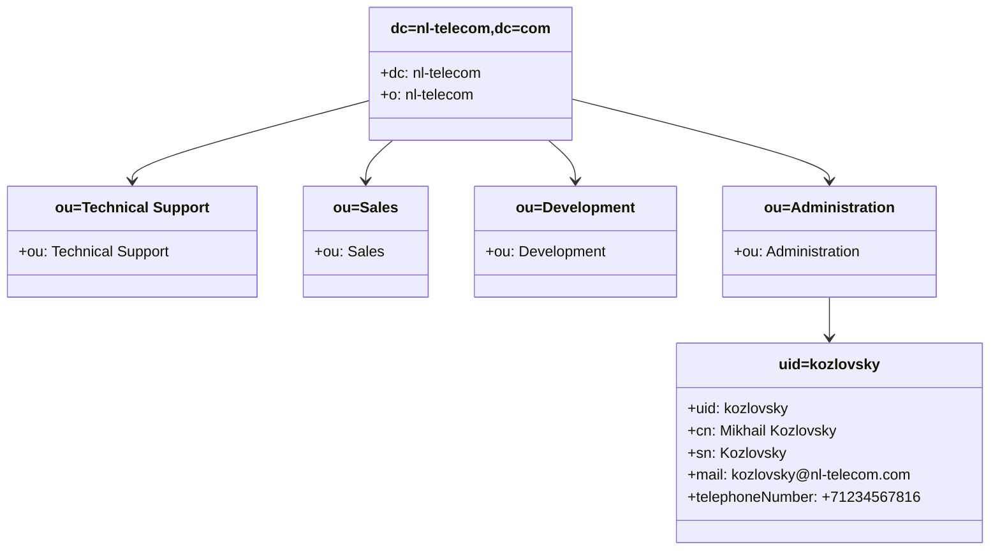

### LDAP Directory Structure for "nl-telecom" Company


Также пример каталога LDAP можно найти по [тут](https://pro-ldap.ru/tr/zytrax/ch5/step4.html)
### Base Structure
```ldif
dn: dc=nl-telecom,dc=com
objectClass: dcObject
objectClass: organization
dc: nl-telecom
o: nl-telecom
```

### Organizational Units
```ldif
dn: ou=Technical Support,dc=nl-telecom,dc=com
objectClass: organizationalUnit
ou: Technical Support

dn: ou=Sales,dc=nl-telecom,dc=com
objectClass: organizationalUnit
ou: Sales

dn: ou=Development,dc=nl-telecom,dc=com
objectClass: organizationalUnit
ou: Development

dn: ou=Administration,dc=nl-telecom,dc=com
objectClass: organizationalUnit
ou: Administration
```

### User Entries

#### Technical Support Department (5 users)
```ldif
dn: uid=ivanov,ou=Technical Support,dc=nl-telecom,dc=com
objectClass: inetOrgPerson
objectClass: organizationalPerson
objectClass: person
uid: ivanov
cn: Ivan Ivanov
sn: Ivanov
givenName: Ivan
displayName: Ivanov I.A.
mail: ivanov@nl-telecom.com
telephoneNumber: +71234567801
departmentNumber: 100
ou: Technical Support

dn: uid=petrov,ou=Technical Support,dc=nl-telecom,dc=com
objectClass: inetOrgPerson
objectClass: organizationalPerson
objectClass: person
uid: petrov
cn: Petr Petrov
sn: Petrov
givenName: Petr
displayName: Petrov P.S.
mail: petrov@nl-telecom.com
telephoneNumber: +71234567802
departmentNumber: 100
ou: Technical Support

dn: uid=sidorov,ou=Technical Support,dc=nl-telecom,dc=com
objectClass: inetOrgPerson
objectClass: organizationalPerson
objectClass: person
uid: sidorov
cn: Sergey Sidorov
sn: Sidorov
givenName: Sergey
displayName: Sidorov S.V.
mail: sidorov@nl-telecom.com
telephoneNumber: +71234567803
departmentNumber: 100
ou: Technical Support

dn: uid=kuznetsov,ou=Technical Support,dc=nl-telecom,dc=com
objectClass: inetOrgPerson
objectClass: organizationalPerson
objectClass: person
uid: kuznetsov
cn: Alexey Kuznetsov
sn: Kuznetsov
givenName: Alexey
displayName: Kuznetsov A.D.
mail: kuznetsov@nl-telecom.com
telephoneNumber: +71234567804
departmentNumber: 100
ou: Technical Support

dn: uid=smirnov,ou=Technical Support,dc=nl-telecom,dc=com
objectClass: inetOrgPerson
objectClass: organizationalPerson
objectClass: person
uid: smirnov
cn: Dmitry Smirnov
sn: Smirnov
givenName: Dmitry
displayName: Smirnov D.K.
mail: smirnov@nl-telecom.com
telephoneNumber: +71234567805
departmentNumber: 100
ou: Technical Support
```

#### Sales Department (5 users)
```ldif
dn: uid=popova,ou=Sales,dc=nl-telecom,dc=com
objectClass: inetOrgPerson
objectClass: organizationalPerson
objectClass: person
uid: popova
cn: Anna Popova
sn: Popova
givenName: Anna
displayName: Popova A.M.
mail: popova@nl-telecom.com
telephoneNumber: +71234567806
departmentNumber: 200
ou: Sales

dn: uid=volkov,ou=Sales,dc=nl-telecom,dc=com
objectClass: inetOrgPerson
objectClass: organizationalPerson
objectClass: person
uid: volkov
cn: Maxim Volkov
sn: Volkov
givenName: Maxim
displayName: Volkov M.A.
mail: volkov@nl-telecom.com
telephoneNumber: +71234567807
departmentNumber: 200
ou: Sales

dn: uid=kozlov,ou=Sales,dc=nl-telecom,dc=com
objectClass: inetOrgPerson
objectClass: organizationalPerson
objectClass: person
uid: kozlov
cn: Igor Kozlov
sn: Kozlov
givenName: Igor
displayName: Kozlov I.N.
mail: kozlov@nl-telecom.com
telephoneNumber: +71234567808
departmentNumber: 200
ou: Sales

dn: uid=novikova,ou=Sales,dc=nl-telecom,dc=com
objectClass: inetOrgPerson
objectClass: organizationalPerson
objectClass: person
uid: novikova
cn: Elena Novikova
sn: Novikova
givenName: Elena
displayName: Novikova E.P.
mail: novikova@nl-telecom.com
telephoneNumber: +71234567809
departmentNumber: 200
ou: Sales

dn: uid=belov,ou=Sales,dc=nl-telecom,dc=com
objectClass: inetOrgPerson
objectClass: organizationalPerson
objectClass: person
uid: belov
cn: Artem Belov
sn: Belov
givenName: Artem
displayName: Belov A.S.
mail: belov@nl-telecom.com
telephoneNumber: +71234567810
departmentNumber: 200
ou: Sales
```

#### Development Department (5 users)
```ldif
dn: uid=orlov,ou=Development,dc=nl-telecom,dc=com
objectClass: inetOrgPerson
objectClass: organizationalPerson
objectClass: person
uid: orlov
cn: Pavel Orlov
sn: Orlov
givenName: Pavel
displayName: Orlov P.V.
mail: orlov@nl-telecom.com
telephoneNumber: +71234567811
departmentNumber: 300
ou: Development

dn: uid=egorov,ou=Development,dc=nl-telecom,dc=com
objectClass: inetOrgPerson
objectClass: organizationalPerson
objectClass: person
uid: egorov
cn: Andrey Egorov
sn: Egorov
givenName: Andrey
displayName: Egorov A.K.
mail: egorov@nl-telecom.com
telephoneNumber: +71234567812
departmentNumber: 300
ou: Development

dn: uid=zaitsev,ou=Development,dc=nl-telecom,dc=com
objectClass: inetOrgPerson
objectClass: organizationalPerson
objectClass: person
uid: zaitsev
cn: Viktor Zaitsev
sn: Zaitsev
givenName: Viktor
displayName: Zaitsev V.M.
mail: zaitsev@nl-telecom.com
telephoneNumber: +71234567813
departmentNumber: 300
ou: Development

dn: uid=voronova,ou=Development,dc=nl-telecom,dc=com
objectClass: inetOrgPerson
objectClass: organizationalPerson
objectClass: person
uid: voronova
cn: Olga Voronova
sn: Voronova
givenName: Olga
displayName: Voronova O.I.
mail: voronova@nl-telecom.com
telephoneNumber: +71234567814
departmentNumber: 300
ou: Development

dn: uid=rybakov,ou=Development,dc=nl-telecom,dc=com
objectClass: inetOrgPerson
objectClass: organizationalPerson
objectClass: person
uid: rybakov
cn: Denis Rybakov
sn: Rybakov
givenName: Denis
displayName: Rybakov D.A.
mail: rybakov@nl-telecom.com
telephoneNumber: +71234567815
departmentNumber: 300
ou: Development
```

#### Administration Department (5 users)
```ldif
dn: uid=kozlovsky,ou=Administration,dc=nl-telecom,dc=com
objectClass: inetOrgPerson
objectClass: organizationalPerson
objectClass: person
uid: kozlovsky
cn: Mikhail Kozlovsky
sn: Kozlovsky
givenName: Mikhail
displayName: Kozlovsky M.L.
mail: kozlovsky@nl-telecom.com
telephoneNumber: +71234567816
departmentNumber: 400
ou: Administration

dn: uid=vasileva,ou=Administration,dc=nl-telecom,dc=com
objectClass: inetOrgPerson
objectClass: organizationalPerson
objectClass: person
uid: vasileva
cn: Natalya Vasileva
sn: Vasileva
givenName: Natalya
displayName: Vasileva N.S.
mail: vasileva@nl-telecom.com
telephoneNumber: +71234567817
departmentNumber: 400
ou: Administration

dn: uid=borisov,ou=Administration,dc=nl-telecom,dc=com
objectClass: inetOrgPerson
objectClass: organizationalPerson
objectClass: person
uid: borisov
cn: Vladimir Borisov
sn: Borisov
givenName: Vladimir
displayName: Borisov V.G.
mail: borisov@nl-telecom.com
telephoneNumber: +71234567818
departmentNumber: 400
ou: Administration

dn: uid=nikolaeva,ou=Administration,dc=nl-telecom,dc=com
objectClass: inetOrgPerson
objectClass: organizationalPerson
objectClass: person
uid: nikolaeva
cn: Ekaterina Nikolaeva
sn: Nikolaeva
givenName: Ekaterina
displayName: Nikolaeva E.V.
mail: nikolaeva@nl-telecom.com
telephoneNumber: +71234567819
departmentNumber: 400
ou: Administration

dn: uid=filatov,ou=Administration,dc=nl-telecom,dc=com
objectClass: inetOrgPerson
objectClass: organizationalPerson
objectClass: person
uid: filatov
cn: Alexey Filatov
sn: Filatov
givenName: Alexey
displayName: Filatov A.R.
mail: filatov@nl-telecom.com
telephoneNumber: +71234567820
departmentNumber: 400
ou: Administration
```

### Summary

This LDAP directory contains:
- Base organization: nl-telecom
- 4 departments: Technical Support, Sales, Development, Administration
- 20 user entries with complete contact information
- All entries follow standard LDAP object classes and attributes
- Data is presented in standard LDIF format for easy import

The structure can be imported directly into OpenLDAP, Active Directory or other LDAP-compatible directory services.

---
#ldap